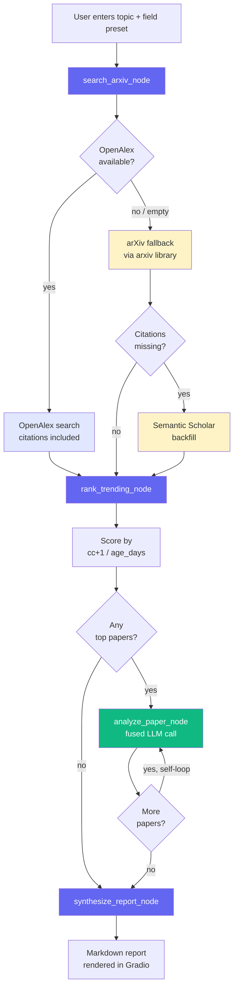

# GapScope

A Gradio app that searches recent arXiv papers on a topic, ranks them by a trending score, and uses Groq-hosted Llama 3.3 70B to summarize each paper, identify research gaps, and propose novel research directions — all in a single fused LLM call per paper.

Live demo: https://huggingface.co/spaces/Arijit171/GapScope

## How it works

1. User enters a topic (e.g. *"efficient fine-tuning of LLMs"*) and picks a field preset (AI/ML, NLP, CV, Robotics, RL, All CS, or no filter)
2. `search_papers` queries **OpenAlex** for recent arXiv-hosted works (last 365 days) — citation counts come back in the same call. Falls back to arXiv's API if OpenAlex is unavailable
3. For papers missing citation data (arXiv-fallback path only), Semantic Scholar fills the gap
4. Papers are ranked by `(citation_count + 1) / age_days` (the `+1` keeps recency as a tiebreaker for fresh, uncited papers)
5. The top 2 papers are each run through **one fused LLM call** that produces a Summary, Key Results, three Gaps, and two Novel Ideas in one pass (temp 0.4, max_tokens 4500)
6. A consolidated markdown report is rendered in the Gradio UI

The orchestration is a LangGraph state machine where `analyze_paper` self-loops over the top-N papers via a conditional edge.

## Process flowchart



`analyze_paper_node` (green) is the only node that calls the LLM. With `TOP_N=2` the graph makes exactly 2 Groq calls per run.

## Tech stack

- **UI:** Gradio 6.14
- **Agent orchestration:** LangGraph (state machine with conditional edges + self-loop)
- **LLM:** Groq (`llama-3.3-70b-versatile`) via `langchain-groq`
- **Data sources:** OpenAlex (primary, 100k req/day, no key), arXiv (fallback via `arxiv` library), Semantic Scholar (citation backfill when arxiv fallback is used)
- **Reliability:** `tenacity` retries with exponential backoff on HTTP calls, JSON cache (7-day TTL)

## Local setup

```powershell
# clone the repo, then:
python -m venv venv
.\venv\Scripts\Activate.ps1
pip install -r requirements.txt

# add your Groq API key to .env
# GROQ_API_KEY=gsk_...

python app.py
```

The app will open at `http://127.0.0.1:7860`.

Get a free Groq API key at https://console.groq.com.

## Deploy to Hugging Face Spaces

1. Create a new Space with the **Gradio** SDK
2. Push the repo (everything except `.env`, `cache.json`, `venv/`, and `__pycache__/`)
3. Add `GROQ_API_KEY` under **Settings → Repository secrets**
4. The Space will auto-install from `requirements.txt` and launch `app.py`

## Project structure

```
app.py            Gradio interface, field presets, generator handler with status + progress yields
graph.py          LangGraph state and 4 nodes (search, rank, analyze_paper [self-loop], synthesize)
tools.py          OpenAlex + arXiv + Semantic Scholar clients with retries and caching
prompts.py        COMBINED_PROMPT (Summary + Key Results + Gaps + Novel Ideas in one fused call)
cache.py          JSON cache with 7-day TTL
requirements.txt  Pinned dependencies
.env              Local secrets (do not commit)
.gitignore        Ignores .env, cache.json, venv, __pycache__, .gradio
```

## Demo

*(Screenshot placeholder — capture the UI after running a query and embed `demo.png` here.)*

## Output quality notes

**Strengths**
- Recency-biased: only papers from the last 365 days, so the report reflects what is genuinely trending
- Structured output: every section uses fixed markdown templates (Summary / Key Results / Gaps Found / Novel Ideas), so the report is easy to scan
- Cheap: **2 LLM calls per run** (1 fused call × 2 papers), all on the Groq free tier
- Sustainable for multi-user deployment: OpenAlex's 100k req/day handles concurrent users far better than arXiv's per-IP rate limit

**Weaknesses / known limits**
- The trending score uses `(citation_count + 1) / age_days` as a proxy for `citations_last_30d / age_days`. OpenAlex / Semantic Scholar do not expose a 30-day citation delta cheaply, so very fresh papers (where citations have not yet caught up) may be under-ranked relative to slightly older papers
- Gap and idea quality is bounded by the abstract — the agent does not read full PDFs, so methodological nuances inside the paper body can be missed
- The agent can occasionally invent plausible-sounding but unstated results; the prompt warns against this but does not eliminate it
- Semantic Scholar rate-limits aggressively on the free tier; on persistent failure the ranker falls back to date sorting and the report still produces

## Cost

Groq free tier covers all LLM calls. OpenAlex, arXiv, and Semantic Scholar are free. Total external cost per run: $0.
