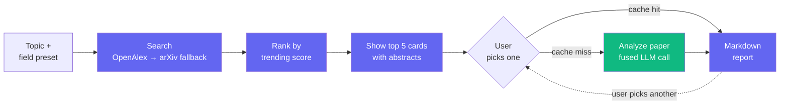

<div align="center">

# GapScope

**Find research gaps in trending arXiv papers — powered by OpenAlex, LangGraph, and Groq Llama 3.3 70B.**

[](https://huggingface.co/spaces/Arijit171/GapScope)
[](https://github.com/ARIJIT00171/GapScope)
[](https://www.python.org/)
[](https://gradio.app/)

</div>

A Gradio app that searches recent arXiv papers on a topic, ranks the top 5 by a trending score, and lets the user pick any paper to generate a structured research-gap report using Groq-hosted Llama 3.3 70B. Each report is one fused LLM call producing Summary, Key Results, three Gaps, and two Novel Ideas.

## How it works

1. User enters a topic (e.g. *"efficient fine-tuning of LLMs"*) and picks a field preset (AI/ML, NLP, CV, Robotics, RL, All CS, or no filter)
2. `search_papers` queries **OpenAlex** for recent arXiv-hosted works (last 365 days). The field preset maps to an **OpenAlex concept ID** (e.g. `C204321447` for NLP, `C31972630` for Computer Vision) and is applied as a server-side filter, so different fields return cleanly disjoint result sets. Citation counts come back in the same call. Falls back to arXiv's API if OpenAlex is unavailable
3. For papers missing citation data (arXiv-fallback path only), Semantic Scholar fills the gap
4. Papers are ranked by `(citation_count + 1) / age_days` (the `+1` keeps recency as a tiebreaker for fresh, uncited papers); the **top 5** are surfaced as cards in the UI with title, date, venue (when published), and the full scrollable abstract
5. The user **picks one paper** and clicks _Analyze selected paper_. A single fused LLM call (temp 0.4, max_tokens 4500) produces Summary, Key Results, three Gaps, and two Novel Ideas. The result is cached per-session by arXiv ID, so re-selecting the same paper is instant and free
6. The markdown report renders in a card below the picker; the user can then pick another paper from the same list without re-searching

The orchestration is two compiled LangGraph state machines: `search_rank_graph` (search → rank → end) runs first and makes **zero LLM calls**, then `analyze_one_graph` (analyze → synthesize → end) runs **once per user click** on a chosen paper.

## Process flowchart



`Analyze` (green) is the only LLM-calling step. With the per-session cache, the same paper is analyzed at most once — subsequent picks of the same paper return instantly.

## Tech stack

- **UI:** Gradio 6.14 (custom CSS card UI for paper picker, dark-mode-aware via Gradio CSS vars, animated spinner during LLM calls)
- **Agent orchestration:** LangGraph (two compiled state machines — `search_rank_graph` and `analyze_one_graph`)
- **LLM:** Groq (`llama-3.3-70b-versatile`) via `langchain-groq`
- **Data sources:** OpenAlex (primary, 100k req/day, no key; concept-ID filtering for fields), arXiv (fallback via `arxiv` library), Semantic Scholar (citation backfill when arxiv fallback is used)
- **Reliability:** `tenacity` retries with exponential backoff on HTTP calls, JSON cache (7-day TTL) for paper metadata, in-memory per-session cache for LLM analyses

## Local setup

```powershell
# clone the repo, then:
python -m venv venv
.\venv\Scripts\Activate.ps1
pip install -r requirements.txt

# add your Groq API key to .env
# GROQ_API_KEY=gsk_...

python app.py
```

The app will open at `http://127.0.0.1:7860`.

Get a free Groq API key at https://console.groq.com.

## Deploy to Hugging Face Spaces

1. Create a new Space with the **Gradio** SDK
2. Push the repo (everything except `.env`, `cache.json`, `venv/`, and `__pycache__/`)
3. Add `GROQ_API_KEY` under **Settings → Repository secrets**
4. The Space will auto-install from `requirements.txt` and launch `app.py`

## Project structure

```
app.py            Gradio interface — field presets, two-stage search/analyze handlers, session state for picked papers and cached analyses
graph.py          Two compiled LangGraphs — search_rank_graph (search → rank) and analyze_one_graph (analyze → synthesize)
tools.py          OpenAlex (with concept-ID filter) + arXiv fallback + Semantic Scholar clients with retries and caching
prompts.py        COMBINED_PROMPT (Summary + Key Results + Gaps + Novel Ideas in one fused call)
cache.py          JSON cache with 7-day TTL
requirements.txt  Pinned dependencies
.env              Local secrets (do not commit)
.gitignore        Ignores .env, cache.json, venv, __pycache__, .gradio
```

## Demo

*(Screenshot placeholder — capture the UI after running a query and embed `demo.png` here.)*

## Output quality notes

**Strengths**
- Recency-biased: only papers from the last 365 days, so the picker reflects what is genuinely trending
- User-driven: skim the top 5 abstracts and spend LLM budget only on papers you actually want analyzed
- Structured output: every report uses a fixed markdown template (Summary / Key Results / Gaps Found / Novel Ideas), so reports are easy to scan and compare
- Cheap and lazy: **0 LLM calls during search**, **1 fused call per analyze click**, **0 LLM calls for re-selecting an already-analyzed paper** (per-session cache). All Groq free tier
- Sustainable for multi-user deployment: OpenAlex's 100k req/day handles concurrent users far better than arXiv's per-IP rate limit, and concept-ID filtering keeps result sets clean across fields

**Weaknesses / known limits**
- The trending score uses `(citation_count + 1) / age_days` as a proxy for `citations_last_30d / age_days`. OpenAlex / Semantic Scholar do not expose a 30-day citation delta cheaply, so very fresh papers (where citations have not yet caught up) may be under-ranked relative to slightly older papers
- Gap and idea quality is bounded by the abstract — the agent does not read full PDFs, so methodological nuances inside the paper body can be missed
- The agent can occasionally invent plausible-sounding but unstated results; the prompt warns against this but does not eliminate it
- Semantic Scholar rate-limits aggressively on the free tier; on persistent failure the ranker falls back to date sorting and the report still produces
- OpenAlex concepts are coarser than arXiv categories — a paper tagged with "Computer vision" might still touch NLP techniques, so field filtering reduces but does not eliminate cross-field overlap

## Cost

Groq free tier covers all LLM calls. OpenAlex, arXiv, and Semantic Scholar are free. Total external cost per run: $0.
